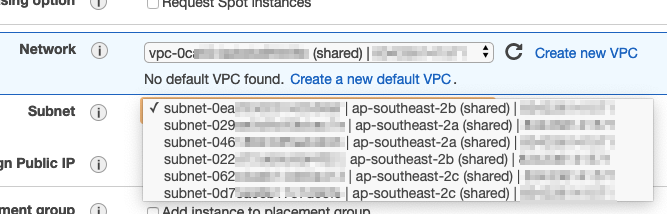
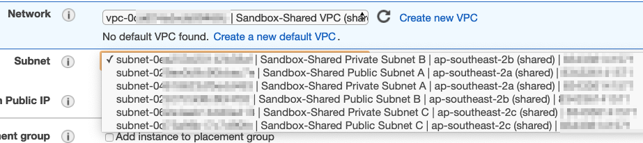

# Shared Amazon VPC/subnet name tagging

As of writing, when using [shared](https://docs.aws.amazon.com/vpc/latest/userguide/vpc-sharing.html) [Amazon Virtual Private Cloud (VPC)](https://aws.amazon.com/vpc/) subnets, the member accounts cannot see the 'Name' of the shared subnets. This makes it challenging to know which ones are public subnets, private subnets, etc. 



This is a simple [AWS CloudFormation](https://aws.amazon.com/cloudformation/) template, which needs to be deployed on the member accounts, that takes a list of VPC/Subnet ID to Name mappings, and just tags it. The template can be deployed to member accounts in an [AWS Organization](https://aws.amazon.com/organizations/) using [CloudFormation StackSets](https://docs.aws.amazon.com/AWSCloudFormation/latest/UserGuide/what-is-cfnstacksets.html), or [Customizations for Control Tower](https://docs.aws.amazon.com/controltower/latest/userguide/customize-landing-zone.html), or any other method. 

The end result is that shared VPCs have the Name tags visible for VPC consumers:




## Installation

### Shared VPC creation

If you don't have a shared VPC already, you can use the following steps:

- In the AWS Organization management account, [enable sharing with the AWS Organization](https://docs.aws.amazon.com/ram/latest/userguide/getting-started-sharing.html). To do this with [AWS CloudShell](https://aws.amazon.com/cloudshell/), run `aws ram enable-sharing-with-aws-organization`.

- In a network or shared services account, create a normal VPC using your usual template, making sure it has the Name tags in the subnets/VPCs. An example VPC template is included in [sample-shared-vpc/Standard-VPC.stack.yml](sample-shared-vpc/Standard-VPC.stack.yml).

- Either share the VPC to an OU using [Resource Access Manager manually](https://docs.aws.amazon.com/vpc/latest/userguide/vpc-sharing.html), or use the given [CloudFormation template](sample-shared-vpc/Share-VPC.stack.yml). 

- Verify that you can see the VPC in the member account.


### Testing the stack in a member account

You can quickly test it on a single member account (consumer of the shared VPC).

- You need to first create a list of mappings between the VPC/subnet IDs and names, which will be the input for the stack Parameter in the next step. You can either do this manually by logging into the account that is sharing the VPC, and then creating a string in the format id-1|name-1|id-2|name-2| (include the trailing |), for example:

```
vpc-1234abcd|My Shared VPC|subnet-2345abcd|Shared Private Subnet A|subnet-3456abcd|Shared Private Subnet B|
```

or alternatively, you can construct that string automatically using AWS CloudShell on the account that is hosting the VPC. Get the VPC ID, and in CloudShell, type (replacing the `vpc_id=...`):

```bash
vpc_id=vpc-1234abcd

( aws ec2 describe-vpcs --query "Vpcs[?VpcId=='"$vpc_id"'].[VpcId,Tags[?Key=='Name'].Value]" --output text ; aws ec2 describe-subnets --query "Subnets[?VpcId=='"$vpc_id"'].[SubnetId,Tags[?Key=='Name'].Value]" --output text ) | tr '\n' '|'
```

This will output a string in the required format. Copy it as is (including the trailing '|').

- Log into a member account. Verify that the subnets do not have the Name tag. Then create the [Tag-shared-VPC.stack.yml](Tag-shared-VPC.stack.yml) CloudFormation stack, and set the Parameter to the string you constructed in the previous step. Verify that the subnets are tagged after the stack gets created. After testing, delete the stack (note that deleting the stack does not remove the tags). 

You can then add the template to whatever system you use to create the stacks in member accounts. For instructions to do so with CloudFormation StackSets, see [Create a stack set with service-managed permissions](https://docs.aws.amazon.com/AWSCloudFormation/latest/UserGuide/stacksets-getting-started-create.html#stacksets-orgs-associate-stackset-with-org).


## Security

See [CONTRIBUTING](CONTRIBUTING.md#security-issue-notifications) for more information.

## License

This library is licensed under the MIT-0 License. See the LICENSE file.
